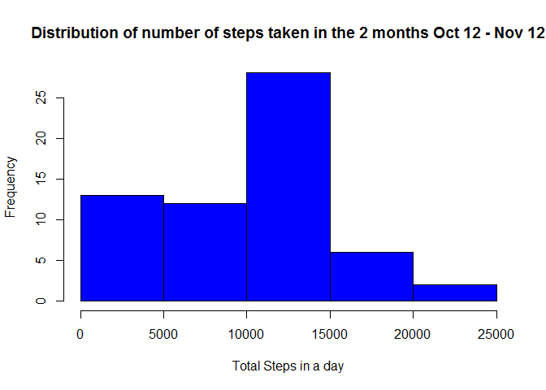
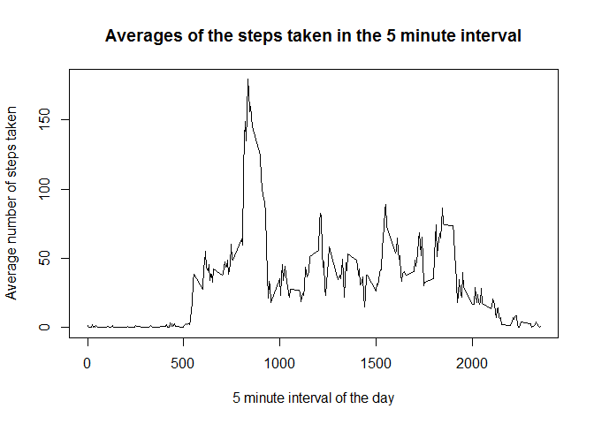
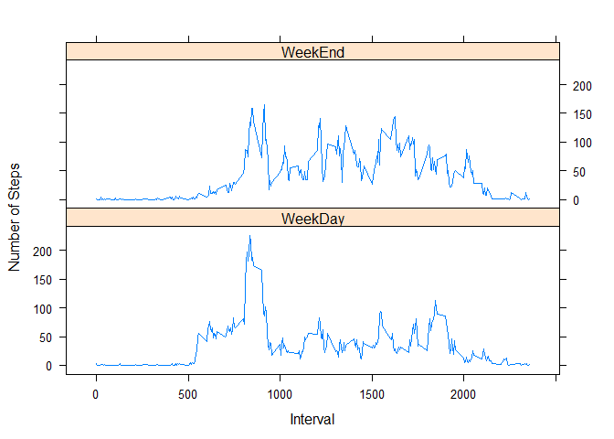

Reproducible Research: Peer Assessment 1
-------------------------------------------------
-------------------------------------------------

##1. Loading and preprocessing the data

```r
#Read the data
data <- read.csv("C:\\Amrith\\R\\data\\RepRes\\Ass1\\activity.csv")

#Load the knotr library
library(knitr)
```

##2. Analysis on the data

  **2a. Calculate the total number of steps, the mean and median per day**  

```r
#Calculate the total steps taken each day
stepsDay<-tapply(data$steps, data$date, sum, na.rm = T, simplify = TRUE)

# Not reporting the below 2 calculations - Calculation of the mean and median in the 5 minute interval for the 2 month period 
meanSpD<-aggregate(data$steps, list(date = data$date), mean, na.rm=T )
medianSpD<-aggregate(data$steps, list(date = data$date), median, na.rm=T )
```
  
- Distribution of total number of steps taken each day

```r
hist(stepsDay, col="blue", main="Distribution of number of steps taken in the 2 months Oct 12 - Nov 12", xlab="Total Steps in a day")
```

 

- Mean value of the number of steps per day taken in the 2 months is **9354.2295082**  
  
- Median value of the number of steps taken per day in the 2 months is **10395**   
  
  
  **2b. Average Daily Activity Pattern**    

```r
#Total the steps taken for a 5 minute interval for all the days in the dataset
intSteps<-tapply(data$steps, data$interval, sum, na.rm=TRUE, simplify = F)

#convert the list into a dataframe
intStepsdf<-as.data.frame(unlist(intSteps))

#Create an intervals column from the rowname column
intStepsdf$intervals<-rownames(intStepsdf)

#Assign a meaningful column name to the dataframe created
names(intStepsdf)[1]<-c("totalSteps")

#Calculate the average number of steps by divising total steps by the number of days in the dataset (61) 
intStepsdf$aveSteps<-intStepsdf$totalSteps/61
intStepsdf <- transform(intStepsdf, intervals=as.integer(intervals))

#Plot interval vs. Average
plot(intStepsdf$intervals, intStepsdf$aveSteps, type="l", main="Averages of the steps taken in the 5 minute interval", xlab = "5 minute interval of the day", ylab="Average number of steps taken")
```

 

```r
library(plyr)
```
  
  
The 5-minute interval, on average across all the days in the dataset, containing the maximum number of steps is **835**
  
  **2c. Imputing missing values**  

*The missing values are imputed by assigning the mean value for the 5 minute interval which the value is missing*
  
  
The total number of missing values in the steps column of the dataset is **2304**  
*(The date and interval columns do not have any missing values)*    
  

```r
#Calculate the average steps in each interval and create a new column in the dataframe to hold the value
data$aveStepsInInt <- sapply(data$interval, function(x) intStepsdf[match(x,intStepsdf$intervals),3])

#Filter the rows with NA values for the steps column
naData<-data[is.na(data$steps), ]
#Assign the mean value calculated for the interval to the NA values
naData$steps<-naData$aveStepsInInt

#Filter the rows with values for the steps column
valData<-data[!is.na(data$steps), ]

#Merge the two datasets to create a dataset with no NA values
allData<-rbind(naData, valData)

#Order the data by date and interval
ordData<-allData[with(allData, order(allData$date, allData$interval)),]

#Calculate the total steps for each day with this complete dataset
mStepsDay<-tapply(ordData$steps, ordData$date, sum, simplify = TRUE)

hist(mStepsDay, col = "blue", main="Distribution of number of steps taken with NA values imputed", xlab="Total Steps in a day")
```

 
  
  
- Mean value of the number of steps taken per day in the 2 months is **10581.01**  
  
- Median value of the number of steps taken per day in the 2 months is **10395**  
  
  
- The mean value of the number of steps taken in a day has increased after the missing values have been imputed  
  
  
- The median value is the same before and after imputing the missing values  
  

**2d. Are there differences in activity patterns between weekdays and weekends?**  
  

```r
# Identify the dates as weekdays and weekends
ordData$wd<-sapply(weekdays(as.Date(ordData$date), T), function(x) x %in% c("Mon", "Tue", "Wed", "Thu", "Fri"))

# Calculate the mean by interval and by weekday 
aggwd<-aggregate(ordData$steps, by=list(interval = ordData$interval, iswd = ordData$wd), mean)

# Assign the labels weekday and weekend to each row in the dataset in order the generate the plot
aggwd$iswd<-sapply(aggwd[, 2], function(x) ifelse(x == FALSE, c("WeekEnd"), c("WeekDay")))
```

- Plot showing the difference in activity patterns between weekdays and weekends  


```r
library(lattice)
xyplot(x ~ interval | iswd, aggwd, layout=c(1,2), panel = panel.lines, xlab = "Interval", ylab = "Number of Steps")
```

 
